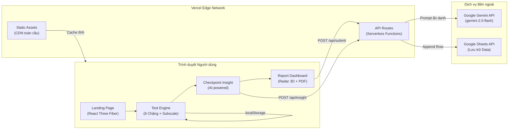
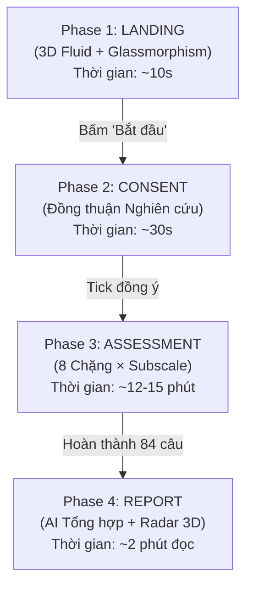
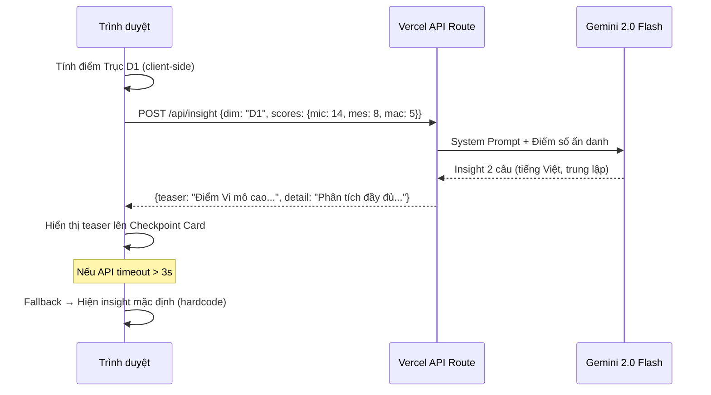
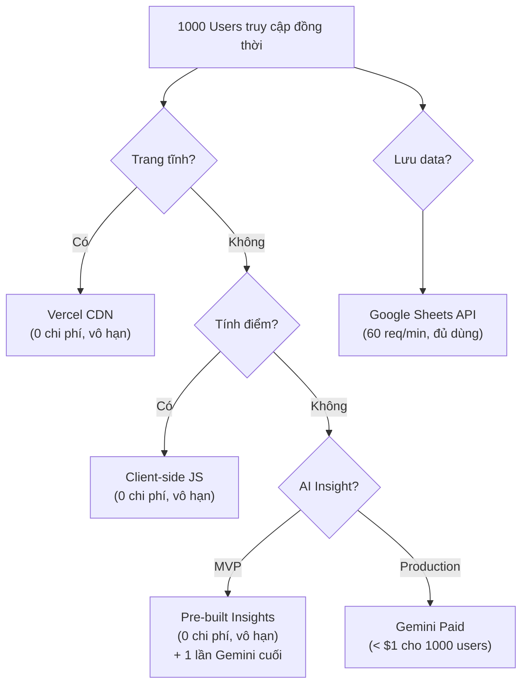

# MVAB v2.1 — Kiến trúc Kỹ thuật & Kế hoạch Triển khai

> **Phiên bản:** 1.0 | **Ngày:** 2026-09-25  
> **Mục tiêu:** Xây dựng hệ thống đánh giá tâm lý học kỹ thuật số đẳng cấp quốc tế, tối ưu cho 1000+ người dùng đồng thời (concurrent users), với trải nghiệm mượt mà, giao diện nghệ thuật mang bản sắc Việt Nam, và kiến trúc code bền vững.

---

## MỤC LỤC

1. [Tổng quan Kiến trúc Hệ thống](#1-tổng-quan-kiến-trúc-hệ-thống)
2. [Tech Stack & Công cụ](#2-tech-stack--công-cụ)
3. [Thiết kế Luồng Trải nghiệm Người dùng (UX Flow)](#3-thiết-kế-luồng-trải-nghiệm-người-dùng-ux-flow)
4. [Quản lý Đồ họa 3D & Hiệu năng](#4-quản-lý-đồ-họa-3d--hiệu-năng)
5. [Kiến trúc Code & Tối ưu Luồng Dữ liệu](#5-kiến-trúc-code--tối-ưu-luồng-dữ-liệu)
6. [Hệ thống AI Insight Engine](#6-hệ-thống-ai-insight-engine)
7. [Chiến lược Chịu tải 1000+ Users](#7-chiến-lược-chịu-tải-1000-users)
8. [Bảo mật & Đạo đức Nghiên cứu](#8-bảo-mật--đạo-đức-nghiên-cứu)
9. [Lộ trình Triển khai (Milestones)](#9-lộ-trình-triển-khai-milestones)

---

## 1. Tổng quan Kiến trúc Hệ thống



> [!IMPORTANT]
> **Nguyên tắc cốt lõi:** Toàn bộ logic chấm điểm (Scoring Engine) chạy 100% trên trình duyệt (Client-side). Server chỉ đảm nhận 2 việc duy nhất: (1) Proxy gọi AI sinh Insight, và (2) Ghi dữ liệu vào Google Sheets. Nếu Server sập, bài test vẫn hoạt động bình thường.

---

## 2. Tech Stack & Công cụ

### 2.1. Core Framework

| Lớp | Công nghệ | Lý do chọn |
|-----|-----------|-------------|
| **Ngôn ngữ** | TypeScript 5.x | Ép kiểu tĩnh cho toàn bộ công thức tính điểm, phân cực, quy tắc cấu hình. Loại bỏ 100% lỗi runtime do nhầm kiểu dữ liệu. |
| **Framework** | Next.js 15 (App Router) | Server Components mặc định, API Routes tích hợp sẵn, deploy Vercel 1-click. |
| **Styling** | Tailwind CSS 4 | Utility-first, tree-shaking tự động, hỗ trợ dark mode và responsive mobile-first. |
| **Animation** | Framer Motion 12 | Chuyển cảnh giữa 8 chặng mượt mà (fade, slide, scale). Hỗ trợ `AnimatePresence` để mount/unmount component có hiệu ứng. |
| **3D Graphics** | React Three Fiber + drei + postprocessing | Declarative Three.js trong React. Thư viện `drei` cung cấp các helper sẵn (OrbitControls, Float, MeshDistortMaterial). |
| **Charts** | Recharts hoặc visx | Biểu đồ Radar/Bar nhẹ, tùy biến cao, tích hợp tốt với React. Không dùng Chart.js vì khó custom sâu trong React. |
| **PDF Export** | @react-pdf/renderer | Sinh PDF báo cáo kết quả ngay trên trình duyệt, không cần gọi server. |
| **State Management** | Zustand | Store đơn giản, nhẹ (1KB), không boilerplate như Redux. Quản lý toàn bộ trạng thái bài test (câu trả lời, thời gian, hành vi). |
| **Linting** | ESLint + Prettier + typescript-eslint | Đảm bảo chất lượng code đồng nhất. |

### 2.2. Công cụ Đề xuất Bổ sung

| Công cụ | Vai trò | Lý do đề xuất |
|---------|---------|---------------|
| **Lenis** | Smooth scrolling | Thay thế native scroll bằng cuộn mượt kiểu cinematic. Cực nhẹ (~3KB). Tạo cảm giác "lướt" khi chuyển câu hỏi. |
| **next/font** | Font loading | Load font `Plus Jakarta Sans` từ Google Fonts mà không gây layout shift (CLS = 0). |
| **Sentry** (Free tier) | Error monitoring | Theo dõi lỗi runtime từ 1000 trình duyệt khác nhau. Biết ngay nếu có bug trên thiết bị cụ thể. |
| **Vercel Analytics** (Free) | Web Analytics | Đo tỉ lệ bỏ cuộc (Drop-off rate) tại từng chặng. Biết chặng nào sinh viên hay nản nhất. |
| **sharp** | Image optimization | Next.js dùng `sharp` để tối ưu ảnh tự động (WebP, AVIF). |

---

## 3. Thiết kế Luồng Trải nghiệm Người dùng (UX Flow)

### 3.1. Tổng quan 4 Pha



### 3.2. Phase 1 — Landing Page (Ấn tượng Đầu tiên)

**Mục tiêu:** Tạo cảm giác "Wow" trong 3 giây đầu tiên. Người dùng phải cảm nhận được đây không phải một bảng khảo sát Google Forms bình thường.

**Thiết kế:**
- **Background:** Hiệu ứng 3D "Mực loang trong nước" (WebGL Fluid Simulation) bằng React Three Fiber. Gam màu **Xanh Chàm (Deep Indigo #1e1b4b)** — màu vải nhuộm truyền thống Việt Nam. Chuyển động chậm rãi, thiền định.
- **Card trung tâm:** Glassmorphism (kính mờ) với lớp noise texture nhẹ mô phỏng **Giấy Dó**. Nội dung:
  ```
  MVAB v2.1
  Khung Định hướng Nghề nghiệp & Đánh giá
  Giám sát Lâm sàng Tâm lý học
  
  Thời gian dự kiến: 12–15 phút
  84 câu hỏi · 8 trục đánh giá · Phân tích AI cá nhân hóa
  
  [ Bắt đầu đánh giá ]
  ```
- **Hiệu ứng chuyển cảnh:** Khi bấm "Bắt đầu đánh giá", nền 3D mờ dần (fade out 800ms), card trượt lên và biến mất, nhường chỗ cho Phase 2.

### 3.3. Phase 2 — Informed Consent (Đồng thuận Nghiên cứu)

**Mục tiêu:** Tuân thủ đạo đức nghiên cứu. Ngắn gọn, rõ ràng, không gây sốc.

**Thiết kế:**
- Một trang đơn giản, nền trắng/xám nhạt, font serif nhẹ.
- Nội dung: Mục đích nghiên cứu, quyền rút lui, cam kết ẩn danh.
- Checkbox: *"Tôi đã đọc và đồng ý tham gia nghiên cứu này."*
- Nút "Tiếp tục" chỉ sáng lên khi checkbox được tick.

### 3.4. Phase 3 — Assessment Engine (Trọng tâm)

Đây là phần phức tạp nhất và quyết định chất lượng dữ liệu thu được.

#### 3.4.1. Phân chặng theo Subscale (Dimension-based Paging)

Thay vì cuộn 84 câu, bài test được chia thành **8 Trang (Pages)**, mỗi trang tương ứng với một Trục (Dimension):

| Trang | Trục | Số câu | Subscales |
|-------|------|--------|-----------|
| 1 | D1 — Không gian Can thiệp | 12 | D1_MIC (3), D1_MES (3), D1_MAC (3), D1_FLE (3) |
| 2 | D2 — Dung nạp Mơ hồ | 6 | D2_INT (2), D2_STR (2), D2_NOV (2) |
| 3 | D3 — Phong cách Thực hành | 12 | D3_EMP (4), D3_REL (4), D3_TEC (4) |
| 4 | D4 — Định hướng Đối tượng | 12 | D4_PEO (4), D4_THI (4), D4_DAT (4) |
| 5 | D5 — Cân bằng Thấu cảm | 8 | D5_PT (4), D5_PD (4) |
| 6 | D6 — Tâm thần hóa | 7 | D6_UNC (3), D6_CER (4) |
| 7 | D7 — Động cơ Vị tha | 8 | D7_HEA (4), D7_SAC (4) |
| 8 | D8 — Tương lai Nghề nghiệp + IER | 15+4 | D8_FUT (5), D8_FSE (5), D8_FDE (5), IER (4) |

> [!NOTE]
> Các câu IER (kiểm soát chất lượng) được xen vào cuối Trang 8 để sinh viên không nhận ra đó là "câu bẫy".

#### 3.4.2. Giao diện Câu hỏi — Thiết kế Nhận thức học (Cognitive UX)

**Nguyên tắc "Spotlight" (Tiêu điểm):**
- Chỉ câu hỏi hiện tại được hiển thị sáng rõ (opacity: 1).
- Câu trước đó mờ nhẹ (opacity: 0.3), câu sau chưa hiện.
- Hiệu ứng này buộc não bộ tập trung 100% vào đúng một câu, giảm tải nhận thức (Cognitive Load).

**5 nút lựa chọn trung tính (Neutral Touch Targets):**
- 5 nút hình chữ nhật bo góc, kích thước tối thiểu **44×44px** (chuẩn WCAG cho touch target).
- Màu mặc định: `bg-slate-100` (xám nhạt đồng nhất cho cả 5 nút).
- Màu khi chọn: `bg-slate-700 text-white` (xám đậm — **không dùng màu thiên hướng**).
- Hai dòng chú thích (anchor labels) ở hai đầu: `Rất không đồng ý` (trái) và `Rất đồng ý` (phải).

**Auto-advance (Tự động cuộn):**
- Sau khi chọn đáp án, đợi **300ms**, màn hình trượt mượt mà (Lenis smooth scroll) xuống câu tiếp theo.
- Câu vừa trả lời xong sẽ từ từ mờ đi (opacity: 0.3) trong 200ms.

**Thanh tiến trình (Progress Bar):**
- Sticky ở đỉnh màn hình.
- Hiển thị 2 lớp thông tin: (1) Tiến trình tổng thể `24/84`, (2) Tiến trình chặng hiện tại `3/12 — Trục D1`.
- Thanh fill chuyển màu gradient nhẹ từ `slate-400` sang `slate-600` (trung tính).

#### 3.4.3. Checkpoint Insight (Trạm nghỉ giữa các Chặng)

Khi hoàn thành tất cả câu hỏi của một Trục, giao diện chuyển sang **Màn hình Trạm nghỉ (Checkpoint Screen)**:

**Thiết kế:**
- Background: **Hiệu ứng "Nhịp thở 3D" (Ambient Zen 3D)**: Một khối sương/mực loang hoặc trường hạt bụi mờ (Ambient Dust Particles) co giãn cực nhẹ theo chu kỳ nhịp thở (4s hít vào - 4s thở ra), tạo cảm giác tĩnh tâm phục hồi chú ý (Attention Restoration). Canvas 3D được kích hoạt thức giấc khi vào Checkpoint và lập tức ngủ đông (pause rendering - 0% GPU) khi người dùng trả lời câu hỏi.
- Card kính mờ (Glassmorphism) ở giữa màn hình.

**Nội dung (Ví dụ sau khi hoàn thành Trục D1):**

```
━━━ TRỤC 1: KHÔNG GIAN CAN THIỆP ━━━
Hoàn tất thu thập dữ liệu.

Phân tích sơ bộ: Điểm Vi mô (Micro) của bạn đang ở mức cao.
Trong thực hành lâm sàng, xu hướng này thường đi kèm với
một đặc điểm rất đáng chú ý về ranh giới nghề nghiệp...

[ Xem phân tích chi tiết ]     [ Đi tiếp câu 13 → ]
```

**Cơ chế Đo lường Hành vi Ngầm (Implicit Behavioral Measure):**

| Hành vi | Biến ghi nhận | Ý nghĩa Tâm trắc |
|---------|---------------|-------------------|
| Chọn `[Xem phân tích chi tiết]` | `checkpoint_read_count++` | Nhu cầu đóng nhận thức cao (Need for Closure), tò mò tức thì |
| Chọn `[Đi tiếp]` | `delayed_gratification_score++` | Khả năng trì hoãn sự thỏa mãn, tập trung vào mục tiêu |
| Thời gian ở màn hình Checkpoint | `checkpoint_dwell_time[]` | Mức độ xử lý thông tin (Processing depth) |

**Luồng Sinh Insight (Client → Server → AI):**



> [!WARNING]
> **Quy tắc Fallback bắt buộc:** Mọi lệnh gọi AI đều phải có timeout 3 giây. Nếu quá thời gian, hệ thống tự động hiển thị câu insight mặc định đã được viết sẵn cho từng Trục. Bài test KHÔNG BAO GIỜ được phép bị treo vì lỗi API.

### 3.5. Phase 4 — Report Dashboard (Báo cáo Kết quả)

**Mục tiêu:** Tạo cảm giác "tưởng thưởng" xứng đáng sau 15 phút đầu tư nghiêm túc. Đồng thời cung cấp thông tin có giá trị thực sự.

**Thiết kế:**
- **Biểu đồ Radar "Đông Sơn":** Biểu đồ mạng nhện 8 trục với lưới nền (grid) được cách điệu từ các đường tròn đồng tâm mang hoa văn kỷ hà Trống Đồng. Biểu đồ có hiệu ứng **3D tilt nhẹ** khi di chuột (sử dụng CSS `perspective` + `transform`, không cần WebGL).
- **Bảng màu Heritage:**
  - Xanh Chàm `#312e81` — Các trục lý thuyết/nhận thức (D2, D5, D6).
  - Nâu Đất nung `#9a3412` — Các trục thực hành/ứng dụng (D1, D3, D4).
  - Xám Đá `#44403c` — Các trục động cơ/tương lai (D7, D8).
- **Cụm Nghề nghiệp:** Hiển thị Top 3 cụm nghề phù hợp nhất dưới dạng Card tối giản.
- **Nút hành động:** `[Tải báo cáo PDF]` và `[Làm lại bài test]`.
- **AI Tổng hợp cuối cùng:** Một đoạn văn ngắn (3-4 câu) do Gemini viết, tổng kết toàn bộ 8 trục + dữ liệu hành vi ngầm (checkpoint behavior) thành một "bức chân dung nghề nghiệp" cá nhân hóa.

---

## 4. Quản lý Đồ họa 3D & Hiệu năng

### 4.1. Chiến lược "3D có Chọn lọc" (Selective 3D)

> [!IMPORTANT]
> 3D được kích hoạt có chủ đích ở 3 thời điểm:
> 1. **Landing Page:** WebGL Fluid Shader mực loang đậm chất thị giác tạo ấn tượng đầu tiên.
> 2. **Checkpoint Trạm nghỉ:** Ambient Zen 3D (Nhịp thở/Hạt bụi tĩnh lơ lửng) chạy ở 30fps phục vụ thư giãn và phục hồi chú ý.
> 3. **Report Dashboard:** Hiệu ứng Radar 3D Tilt khi nhận diện hồ sơ nghề nghiệp.
> 
> Trong suốt thời gian trả lời 84 câu hỏi, toàn bộ vòng lặp WebGL được đưa vào trạng thái **ngủ đông tuyệt đối (Dormant - 0% GPU load)** để bảo đảm thao tác cuộn và bấm chọn phản hồi ngay lập tức.

### 4.2. Kỹ thuật Tối ưu 3D

| Kỹ thuật | Mô tả | Tác động |
|----------|-------|----------|
| **Lazy Loading** | Component 3D chỉ được `import()` khi người dùng thực sự ở Landing Page. Khi chuyển sang Phase 2, toàn bộ canvas WebGL bị unmount và giải phóng bộ nhớ GPU. | Giảm bundle ban đầu ~150KB |
| **Fallback cho thiết bị yếu** | Dùng `navigator.hardwareConcurrency` và `renderer.capabilities` để phát hiện thiết bị không hỗ trợ WebGL2 hoặc có GPU yếu. Tự động chuyển sang nền gradient CSS tĩnh (không 3D). | 100% thiết bị đều chạy được |
| **Frame Rate Cap** | Giới hạn canvas 3D ở 30fps thay vì 60fps mặc định. Mắt thường không phân biệt được sự khác biệt ở các hiệu ứng chuyển động chậm (fluid, particles), nhưng tiết kiệm 50% năng lượng pin cho mobile. | Tăng thời lượng pin mobile |
| **Resolution Scaling** | Trên mobile, render canvas 3D ở `devicePixelRatio * 0.75` thay vì full resolution. | Giảm ~40% GPU load |
| **Dispose on Unmount** | Khi rời Landing Page, gọi `renderer.dispose()`, `geometry.dispose()`, `material.dispose()` để xóa sạch bộ nhớ GPU. | Không memory leak |

### 4.3. Hiệu ứng "Mực loang" (Fluid Shader)

**Phương án kỹ thuật:** Sử dụng một custom GLSL Fragment Shader mô phỏng chuyển động chất lỏng (Fluid Dynamics). Shader này chạy trên một plane (mặt phẳng) duy nhất, cực kỳ nhẹ:

```
Cấu trúc:
- 1 PlaneGeometry (2 triangles)
- 1 ShaderMaterial (custom GLSL)
- Uniform: u_time, u_mouse, u_color1 (#1e1b4b), u_color2 (#312e81)
- Không có đèn, không có bóng, không có post-processing
```

**Chi phí hiệu năng dự kiến:** ~2-3ms/frame trên GPU tích hợp (Intel UHD). Không ảnh hưởng đến main thread.

---

## 5. Kiến trúc Code & Tối ưu Luồng Dữ liệu

### 5.1. Cấu trúc Thư mục

```
mvab-v21/
├── app/
│   ├── layout.tsx              # Root layout (font, metadata)
│   ├── page.tsx                # Landing Page (3D)
│   ├── consent/page.tsx        # Informed Consent
│   ├── test/page.tsx           # Assessment Engine (8 chặng)
│   ├── report/page.tsx         # Report Dashboard
│   └── api/
│       ├── insight/route.ts    # POST → Gemini API (sinh insight)
│       └── submit/route.ts     # POST → Google Sheets (lưu data)
│
├── components/
│   ├── three/
│   │   ├── FluidBackground.tsx # Shader mực loang
│   │   └── RadarChart3D.tsx    # Biểu đồ Radar Đông Sơn
│   ├── test/
│   │   ├── QuestionCard.tsx    # Thẻ câu hỏi (Spotlight)
│   │   ├── LikertScale.tsx     # 5 nút trung tính
│   │   ├── ProgressBar.tsx     # Thanh tiến trình
│   │   └── Checkpoint.tsx      # Trạm nghỉ Insight
│   ├── report/
│   │   ├── RadarChart.tsx      # Biểu đồ Radar 2D (SVG)
│   │   ├── CareerCluster.tsx   # Cụm nghề nghiệp
│   │   └── PDFReport.tsx       # Xuất PDF
│   └── ui/
│       ├── GlassCard.tsx       # Card kính mờ + Giấy Dó texture
│       └── Button.tsx          # Nút bấm chuẩn hóa
│
├── lib/
│   ├── scoring.ts              # Toàn bộ công thức tính điểm
│   ├── items.ts                # Mảng 84 câu hỏi (typed)
│   ├── insights-fallback.ts    # 8 câu insight mặc định (backup)
│   ├── configural-rules.ts     # 9 quy tắc cấu hình
│   └── career-clusters.ts      # Thuật toán khớp cụm nghề
│
├── stores/
│   └── test-store.ts           # Zustand store (responses, timing, behavior)
│
├── types/
│   └── index.ts                # Type definitions (Item, Score, Insight...)
│
├── public/
│   ├── textures/
│   │   └── paper-noise.png     # Texture Giấy Dó (64×64, ~2KB)
│   └── fonts/                  # Fallback fonts
│
├── tailwind.config.ts
├── next.config.ts
└── package.json
```

### 5.2. Type Definitions (TypeScript)

```typescript
// types/index.ts

interface TestItem {
  stt: number;
  id: string;           // "D1_MIC_01"
  dim: Dimension;       // "D1" | "D2" | ... | "D8" | "IER"
  subscale: string;     // "Định hướng Can thiệp Vi mô"
  text: string;         // Nội dung câu hỏi tiếng Việt
  polarity: 1 | -1;     // Phân cực chấm điểm
  maxScore: 5;
}

interface UserResponse {
  itemId: string;
  value: 1 | 2 | 3 | 4 | 5;
  latencyMs: number;     // Thời gian suy nghĩ (ms)
  timestamp: number;     // Unix timestamp
}

interface CheckpointBehavior {
  dimension: Dimension;
  choice: 'read' | 'skip';      // Đọc hay Đi tiếp
  dwellTimeMs: number;           // Thời gian ở checkpoint
}

interface TestSession {
  sessionId: string;             // UUID ngẫu nhiên (ẩn danh)
  startedAt: number;
  responses: UserResponse[];
  checkpoints: CheckpointBehavior[];
  ierFlags: number;
  totalDurationMs: number;
}
```

### 5.3. Zustand Store (Quản lý Trạng thái)

```typescript
// stores/test-store.ts

interface TestStore {
  // State
  currentDimension: number;       // 0-7 (D1-D8)
  responses: Map<string, UserResponse>;
  checkpoints: CheckpointBehavior[];
  questionStartTime: number;      // Bấm giờ từng câu
  
  // Actions
  answerQuestion: (itemId: string, value: number) => void;
  recordCheckpoint: (dim: Dimension, choice: 'read' | 'skip') => void;
  nextDimension: () => void;
  
  // Persistence (localStorage)
  hydrate: () => void;            // Khôi phục từ localStorage
  persist: () => void;            // Lưu vào localStorage
}
```

> [!TIP]
> **Auto-save:** Zustand middleware `persist` sẽ tự động serialize toàn bộ state vào `localStorage` sau mỗi lần `answerQuestion()`. Nếu người dùng tắt trình duyệt giữa chừng, khi quay lại, `hydrate()` sẽ khôi phục đúng chặng và câu hỏi họ đang dở.

### 5.4. Scoring Engine (Hoàn toàn Client-side)

```typescript
// lib/scoring.ts

function calculateDimensionScores(responses: Map<string, UserResponse>): DimensionScores {
  // 1. Reverse-code items với polarity === -1
  // 2. Sum scores theo prefix ID (D1_MIC, D1_MES, ...)
  // 3. Normalize sang T-Score (Mean=50, SD=10)
  // 4. Áp dụng 9 Configural Rules
  // 5. Tính Career Cluster compatibility
}
```

> Toàn bộ logic này chạy 100% trên trình duyệt. Không phụ thuộc server. Kể cả khi mất mạng, người dùng vẫn thấy kết quả ngay lập tức.

---

## 6. Hệ thống AI Insight Engine

### 6.1. System Prompt (Giấu trong Vercel API Route)

```
Bạn là một nhà tâm lý học lâm sàng Việt Nam với 20 năm kinh nghiệm.
Nhiệm vụ: Viết nhận xét ngắn (tối đa 2 câu) cho sinh viên vừa hoàn thành 
một trục đánh giá tâm lý. 

QUY TẮC BẮT BUỘC:
1. KHÔNG dán nhãn (ví dụ: "bạn là người hướng nội").
2. KHÔNG phán xét tiêu cực.
3. Dùng ngôn ngữ quan sát trung lập (ví dụ: "Dữ liệu cho thấy...", 
   "Xu hướng của bạn nghiêng về...").
4. Câu cuối PHẢI kết thúc bằng dấu "..." để tạo hiệu ứng lửng lơ 
   (cliffhanger), khuyến khích người dùng hoàn thành bài test.
5. TUYỆT ĐỐI KHÔNG đề cập đến bệnh lý, rối loạn, hoặc chẩn đoán.
6. Viết bằng tiếng Việt chuẩn mực, phong cách học thuật nhưng gần gũi.
```

### 6.2. Prompt Template (Cho từng Trục)

```
Trục: D1 — Không gian Can thiệp
Điểm Vi mô (Micro): {score_mic}/15
Điểm Trung mô (Meso): {score_mes}/15
Điểm Vĩ mô (Macro): {score_mac}/15

Hãy viết 2 câu nhận xét ngắn dưới dạng "teaser" (nhá hàng).
Câu 1: Nhận xét về xu hướng nổi bật nhất.
Câu 2: Kết thúc bằng dấu "..." gợi ý về một đặc điểm sẽ được 
phân tích sâu hơn ở báo cáo cuối.
```

### 6.3. Chiến lược Fallback (Không để bài test chết vì AI)

```typescript
// lib/insights-fallback.ts

const FALLBACK_INSIGHTS: Record<Dimension, string> = {
  D1: "Dữ liệu cho thấy bạn có một xu hướng can thiệp rất rõ nét. "
      + "Ở báo cáo cuối, chúng tôi sẽ phân tích xem xu hướng này "
      + "tương tác với phong cách thực hành của bạn như thế nào...",
  D2: "Cách bạn phản ứng trước sự mơ hồ cho thấy một đặc điểm "
      + "nhận thức đáng chú ý. Điều này sẽ ảnh hưởng trực tiếp "
      + "đến cách bạn xử lý các ca lâm sàng phức tạp...",
  // ... D3 đến D8
};
```

### 6.4. API Route (Vercel Serverless)

```typescript
// app/api/insight/route.ts

export async function POST(req: Request) {
  const { dimension, scores } = await req.json();
  
  const controller = new AbortController();
  const timeout = setTimeout(() => controller.abort(), 3000); // 3s timeout
  
  try {
    const response = await fetch('https://generativelanguage.googleapis.com/...', {
      signal: controller.signal,
      // ... Gemini API call
    });
    clearTimeout(timeout);
    const insight = await response.json();
    return Response.json({ insight: insight.text, source: 'ai' });
  } catch {
    clearTimeout(timeout);
    return Response.json({ 
      insight: FALLBACK_INSIGHTS[dimension], 
      source: 'fallback' 
    });
  }
}
```

---

## 7. Chiến lược Chịu tải 1000+ Users

### 7.1. Phân tích Tải (Load Analysis)

Giả sử 1000 người dùng làm bài test đồng thời:

| Thành phần | Requests | Tải | Giải pháp |
|------------|----------|-----|-----------|
| **Trang tĩnh (HTML/CSS/JS)** | 1000 lượt tải trang | Rất cao | Vercel CDN cache toàn cầu. File tĩnh được serve từ edge node gần nhất (VN có PoP). **Chi phí server: 0.** |
| **Scoring Engine** | 0 requests | Không có | Chạy 100% trên trình duyệt. **Chi phí server: 0.** |
| **AI Insight API** | 1000 users × 8 checkpoints = 8000 requests (rải đều trong 15 phút) | ~9 req/s | Gemini Free: 15 req/min. **→ Cần xử lý qua hàng đợi hoặc pre-generate.** |
| **Google Sheets Submit** | 1000 requests (rải đều trong 5 phút cuối) | ~3 req/s | Google Sheets API: 60 req/min. **→ Đủ nếu rải đều.** |

### 7.2. Giải pháp cho Nút thắt AI (8000 requests)

> [!CAUTION]
> Đây là điểm nghẽn duy nhất của toàn bộ hệ thống. Gemini Free chỉ cho phép 15 requests/phút. Với 1000 users, ta cần **~530 req/min** cho AI Insight. Giải pháp:

**Phương án A — Pre-generate Insight (Khuyến nghị cho MVP):**
- Tạo sẵn **40 bản mẫu Insight** cho mỗi Trục (8 Trục × 5 khoảng điểm = 40 bản). Lưu trong file `insights-prebuilt.ts`.
- Khi người dùng hoàn thành một Trục, code client-side tự chọn bản Insight phù hợp nhất dựa trên khoảng điểm. **Không gọi API.**
- Tại Phase 4 (Báo cáo cuối), mới gọi Gemini **1 lần duy nhất** để viết bản tổng hợp cá nhân hóa.
- **Kết quả:** 1000 users × 1 API call = 1000 requests, rải đều trong 5 phút = ~3.3 req/s. Gemini Free dư sức gánh.

**Phương án B — Queue + Rate Limit (Cho bản Production):**
- Dùng Vercel KV (Redis) làm hàng đợi (queue).
- Khi số request vượt ngưỡng, API Route sẽ trả về bản Fallback ngay lập tức, đồng thời đẩy request vào hàng đợi. Khi hàng đợi rảnh, nó sẽ xử lý và cache kết quả.
- Phức tạp hơn nhưng mở rộng tốt hơn.

**Phương án C — Nâng cấp lên Gemini API trả phí:**
- Chi phí Gemini 2.0 Flash: ~\$0.10/1M input tokens, ~\$0.40/1M output tokens.
- Với 8000 requests × ~200 tokens/request = 1.6M tokens. **Chi phí ước tính: < \$1 cho toàn bộ 1000 bài test.** Rẻ đến mức gần như miễn phí.

### 7.3. Tóm tắt Chiến lược Chịu tải



---

## 8. Bảo mật & Đạo đức Nghiên cứu

### 8.1. Bảo mật Dữ liệu

| Biện pháp | Chi tiết |
|-----------|----------|
| **Ẩn danh hóa** | Mỗi session tạo UUID ngẫu nhiên (`crypto.randomUUID()`). Không thu thập tên, email, hoặc bất kỳ PII nào. |
| **API Key an toàn** | Gemini API Key lưu trong Vercel Environment Variables. Không bao giờ xuất hiện trong code frontend. |
| **HTTPS mặc định** | Vercel tự động cấp SSL. Toàn bộ traffic đều được mã hóa. |
| **Không tracking ngoài** | Không dùng Google Analytics tracking cá nhân. Chỉ dùng Vercel Analytics (aggregate, ẩn danh). |
| **localStorage** | Dữ liệu chỉ tồn tại trên thiết bị người dùng. Không đồng bộ lên cloud trừ khi họ bấm "Nộp bài". |

### 8.2. Đạo đức Tâm trắc học

| Nguyên tắc | Triển khai |
|------------|------------|
| **Informed Consent** | Bắt buộc qua Phase 2 trước khi làm bài. |
| **Quyền rút lui** | Nút "Thoát khỏi bài test" luôn hiển thị. Dữ liệu bị xóa khỏi localStorage ngay khi bấm. |
| **AI không chẩn đoán** | System Prompt ép AI chỉ dùng ngôn ngữ quan sát. Không dán nhãn, không gợi ý bệnh lý. |
| **Kết quả có giới hạn** | Báo cáo kèm disclaimer: "Đây là công cụ định hướng, không thay thế tham vấn chuyên môn." |

---

## 9. Lộ trình Triển khai (Milestones)

### Phase A — Khung xương (Skeleton) `[Ưu tiên 1]`
- [ ] Khởi tạo dự án Next.js + TypeScript + Tailwind.
- [ ] Cấu trúc thư mục theo thiết kế ở mục 5.1.
- [ ] Import 84 câu hỏi từ JSON vào `lib/items.ts` với TypeScript types.
- [ ] Xây dựng Zustand Store (test-store.ts).
- [ ] Xây dựng Scoring Engine (`lib/scoring.ts`) với unit tests.

### Phase B — Assessment Engine `[Ưu tiên 2]`
- [ ] Component `QuestionCard` + `LikertScale` (5 nút trung tính).
- [ ] Phân trang 8 chặng (Dimension-based paging).
- [ ] Hiệu ứng Spotlight (câu hiện tại sáng, câu trước mờ).
- [ ] Auto-advance (Lenis smooth scroll).
- [ ] Progress Bar (sticky, 2 lớp).
- [ ] localStorage auto-save.
- [ ] Latency tracking (bấm giờ từng câu).

### Phase C — Checkpoint System `[Ưu tiên 3]`
- [ ] Component `Checkpoint` (Trạm nghỉ).
- [ ] Pre-built Insights cho 8 Trục (hardcode).
- [ ] 2 nút: `[Xem phân tích]` / `[Đi tiếp]` + ghi nhận hành vi.
- [ ] Hiệu ứng chuyển cảnh Framer Motion (fade + slide).

### Phase D — Landing Page 3D `[Ưu tiên 4]`
- [ ] React Three Fiber setup (lazy load).
- [ ] Fluid Shader "Mực loang" (GLSL).
- [ ] GlassCard với texture Giấy Dó.
- [ ] Chuyển cảnh Landing → Consent → Test.
- [ ] Fallback CSS gradient cho thiết bị yếu.

### Phase E — Report Dashboard `[Ưu tiên 5]`
- [ ] Biểu đồ Radar "Đông Sơn" (SVG + CSS 3D tilt).
- [ ] Career Cluster cards.
- [ ] Configural Rules display.
- [ ] PDF Export (@react-pdf/renderer).
- [ ] IER Audit display.

### Phase F — AI Integration `[Ưu tiên 6]`
- [ ] Vercel API Route `/api/insight` (Gemini 2.0 Flash).
- [ ] System Prompt + Few-shot examples.
- [ ] Timeout 3s + Fallback logic.
- [ ] AI tổng hợp cuối bài (Report narrative).

### Phase G — Polish & Deploy `[Ưu tiên 7]`
- [ ] Vercel API Route `/api/submit` (Google Sheets).
- [ ] Responsive testing (Mobile / Tablet / Desktop).
- [ ] Lighthouse audit (Target: Performance > 90, Accessibility > 95).
- [ ] Sentry error monitoring.
- [ ] Deploy lên Vercel (Production).

---

> [!TIP]
> **Chiến lược MVP thông minh:** Nếu muốn ra mắt nhanh nhất có thể, chỉ cần hoàn thành **Phase A + B + C + E** (bỏ qua 3D và AI). Bài test vẫn hoạt động hoàn chỉnh với Insights hardcode và biểu đồ 2D. Sau đó bổ sung Landing 3D (Phase D) và AI (Phase F) như là bản cập nhật.
